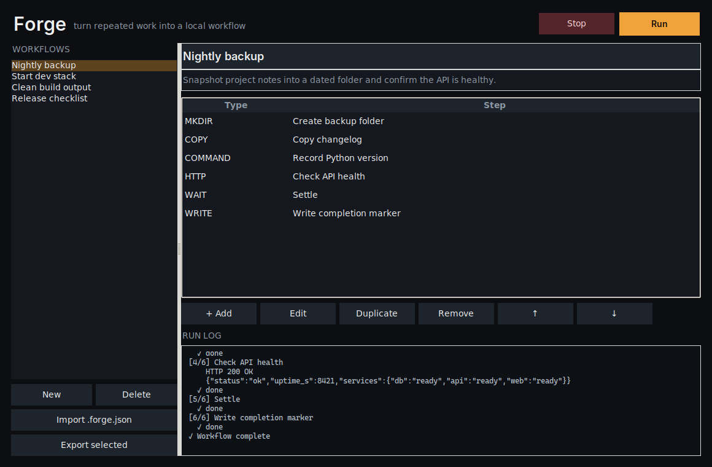

<div align="center">
  
  <h1>Forge</h1>
  <p><strong>A local workflow runner for chaining commands, files, HTTP calls, waits, and app launches into reusable automations.</strong></p>
  <p>
    <a href="https://github.com/purysho/Forge/actions/workflows/ci.yml"></a>
    <a href="https://github.com/purysho/Forge/releases"></a>
    <a href="LICENSE"></a>
    <a href="#download"></a>
  </p>
  <p><strong>Download:</strong> <a href="https://github.com/purysho/Forge/releases/latest/download/Forge-Windows-x64.exe">Windows</a> · <a href="https://github.com/purysho/Forge/releases/latest/download/Forge-macOS-arm64.zip">macOS</a> · <a href="https://github.com/purysho/Forge/releases/latest/download/Forge-Linux-x86_64.tar.gz">Linux</a> · <a href="#run-from-source">Run from source</a> · <a href="https://github.com/purysho/Forge/issues">Report an issue</a></p>
</div>



## What it does

- Named reusable workflows
- Command, copy, move, folder, write, delete, HTTP, wait, and launch steps
- Reorder, duplicate, and edit steps
- Per-step timeout and continue-on-error controls
- Live execution log and stop support
- Portable .forge.json import/export

## Download

| Platform | File |
|---|---|
| Windows 10/11 (x64) | [Forge-Windows-x64.exe](https://github.com/purysho/Forge/releases/latest/download/Forge-Windows-x64.exe) — portable, no installer |
| macOS (Apple Silicon) | [Forge-macOS-arm64.zip](https://github.com/purysho/Forge/releases/latest/download/Forge-macOS-arm64.zip) — unzip and move to Applications |
| Linux (x86_64) | [Forge-Linux-x86_64.tar.gz](https://github.com/purysho/Forge/releases/latest/download/Forge-Linux-x86_64.tar.gz) — extract and run `./Forge` |

Each [release](https://github.com/purysho/Forge/releases) is built from the tagged source by GitHub Actions and carries a `SHA256SUMS.txt`. The builds are not yet code-signed, so on first launch Windows SmartScreen may ask you to confirm ("More info" → "Run anyway"), and macOS may need you to Control-click the app and choose **Open**.

**Status: beta.** Forge does what this README describes and is covered by CI on Windows, macOS and Linux, but it is young: expect rough edges, and please [report them](https://github.com/purysho/Forge/issues).

## Run from source

Requirements: Python 3.10+ with Tk support.

```powershell
pyw forge_desktop.pyw
```

The application uses Python's standard library at runtime.

## Build a standalone Windows executable

```powershell
powershell -ExecutionPolicy Bypass -File .\build-windows.ps1
```

Output:

```text
dist\Forge.exe
```

## Privacy

Workflows and logs stay local in ~/.forge/. There is no hosted runner, account, telemetry, or backend.

## Scope

Forge executes workflows the user creates or imports. Imported workflows should be reviewed before execution, especially command and destructive file steps.

## Release process

- Every push runs tests/compile checks and builds a Windows executable artifact.
- Tags matching `v*` build the executable again, compute SHA256, and publish both files to GitHub Releases.
- See [CHANGELOG.md](CHANGELOG.md) for release history.

## License

MIT
