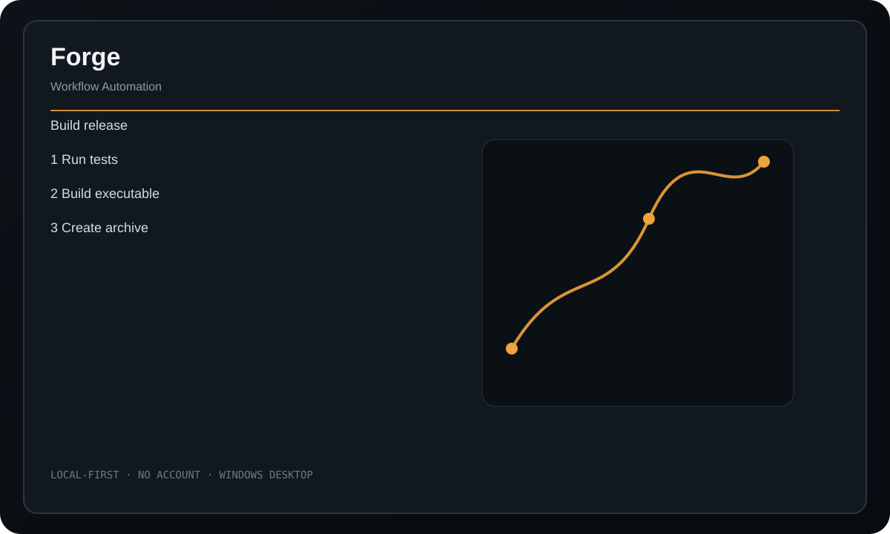

<div align="center">
  
  <h1>Forge</h1>
  <p><strong>A local workflow runner for chaining commands, files, HTTP calls, waits, and app launches into reusable automations.</strong></p>
  <p>
    <a href="https://github.com/purysho/Forge/actions/workflows/ci.yml"></a>
    <a href="https://github.com/purysho/Forge/releases"></a>
    <a href="LICENSE"></a>
  </p>
  <p><a href="https://github.com/purysho/Forge/releases"><strong>Download for Windows</strong></a> · <a href="#run-from-source">Run from source</a> · <a href="https://github.com/purysho/Forge/issues">Report an issue</a></p>
</div>



## What it does

- Named reusable workflows
- Command, copy, move, folder, write, delete, HTTP, wait, and launch steps
- Reorder, duplicate, and edit steps
- Per-step timeout and continue-on-error controls
- Live execution log and stop support
- Portable .forge.json import/export

## Download

Tagged releases are built on `windows-latest` by GitHub Actions. Each release contains `Forge.exe` and `Forge.exe.sha256`. The executable is produced from the source at that tag with PyInstaller.

> Until the first tagged release is published, the latest Windows build is available as the **Forge-windows** artifact on successful CI runs.

## Run from source

Requirements: Python 3.10+ with Tk support.

```powershell
pyw forge_desktop.pyw
```

The application uses Python's standard library at runtime.

## Build a standalone Windows executable

```powershell
powershell -ExecutionPolicy Bypass -File .\build-windows.ps1
```

Output:

```text
dist\Forge.exe
```

## Privacy

Workflows and logs stay local in ~/.forge/. There is no hosted runner, account, telemetry, or backend.

## Scope

Forge executes workflows the user creates or imports. Imported workflows should be reviewed before execution, especially command and destructive file steps.

## Release process

- Every push runs tests/compile checks and builds a Windows executable artifact.
- Tags matching `v*` build the executable again, compute SHA256, and publish both files to GitHub Releases.
- See [CHANGELOG.md](CHANGELOG.md) for release history.

## License

MIT
